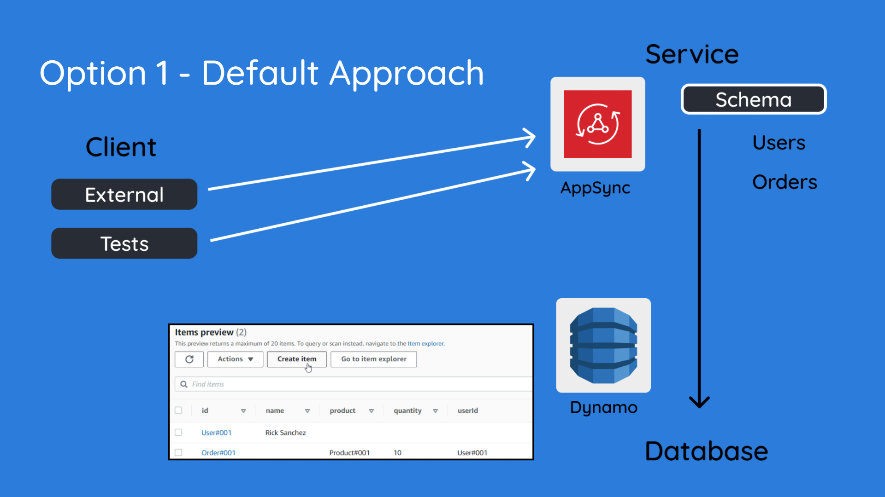
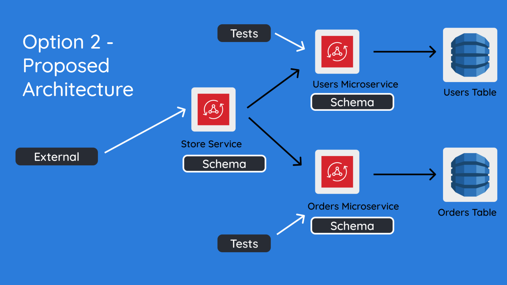

# Microservices architecture with AWS AppSync

## Author

Ashwanth A R

## Demo

[Link to DEMO](https://drive.google.com/file/d/1TxS3bCnVY-CaWtOy5w8MmVlLm4MKAnjn/view?usp=sharing)

## Problem Statement

We need to provide a secure, unified graphQL API for internal and external use, using AppSync. 
External represents either the client application that accesses the API, or the API itself being exposed as a public API. 
Internal represents, any API that is accessed purely by the development team, either for running scripts or integration tests.
There could be a lot of common APIs required between external and internal, but usually internal has a few additional requests that can be made based on the requirement.

## Options Considered

- The straight-forward approach is to create an API with a schema that defines all your entities, 
connect it to a database (in our case, DynamoDB). So, you have one API with one schema which contains all your types.



- Modern applications are created with microservices in mind, to promote rapid iteration because of smaller, faster deployments 
and because of improved fault tolerance (other modules are largely unaffected by the failure of one module).
The second approach involves splitting a single large graphQL API into micro APIs, each with its own schema and database.



## Solution

### Important Technical Decision

Split a large AppSync API into micro APIs as proposed in architecture above (under Option 2).

### Try it yourself

Set AWS credentials for your default AWS profile by running "aws configure" and set your AWS_ACCESS_KEY_ID and AWS_SECRET_ACCESS_KEY.
The deployment will deploy to your default credentials. So, ensure that you set the right account set to default when running `aws configure`

Ensure that you have:

- Java 11 [Corretto](https://docs.aws.amazon.com/corretto/latest/corretto-11-ug/downloads-list.html)
- Gradle 6

Note: when running the deployments as below, replace "ash" with your env name in the `gradlew run` command.

Follow the order below as is, in order to ensure you don't run into other issues.
 
Deploy "Store" service stack first:

```
cd store
./gradlew run --args='ash'
```

This stack will create a "Cognito User Pool" as part of the cdk code.
Both the "Users", and the "Orders" microservice APIs allow authorization via the same cognito user pool.
So, both these services expect the cognito user pool to exist in order to create their API, else their deployments will skip api creation.

The "Store" stack creation will skip the creation of the http resolvers on the first run because the "Users" and "Orders" graphQL APIs dont exist yet.
Once "Store" service stack is created, you need to deploy the microservices from their respective folders. 
You need to cd into the users and orders directories (from root of repo) and execute `gradlew run` as follows.
Remember to replace your env name.

```
cd users
./gradlew run --args='ash'
```

```
cd orders
./gradlew run --args='ash'
```

Once the microservices are deployed, you need to deploy the "Store" service again in order to set up the HTTP resolvers that point to the respective GQL endpoints.

```
cd store
./gradlew run --args='ash'
```

### Running queries on AWS console

Before you can run queries on the console, you need to create a client on Cognito and a user.
You can do this as follows:

- Open cognito console on AWS and navigate to your "User Pools"
- You should a user pool with your env name (e.g. `gqlh-user-pool-ash`). Open it.
- Go to App Clients (under General settings) and click on "Add App Client"
- Give it a name "Test" and uncheck "Generate client secret" (you want a client without a secret)
- Click on "Create app client"
- Navigate to "Users and groups" under "General settings" and click on "Create user"
- Create user with any username, uncheck "Send an invitation" and skip "Phone Number" and "Email".
- Provide a temporary password `Test1234!`
- Uncheck mark as verified options for email and phone number
- Click `Create user`

If you go to the "Queries" section on your AppSync console, you can "Login with User Pools" now.
Choose your ClientId from the list and login with your username and password. 
You will be prompted to enter a new password for this user, and you can provide the same password `Test1234!` again.
You can now run any queries for the AppSync API.

### What is implemented?

In this experiment, we have one service (the Store service) and two microservices (Users and Orders).

The "Users" microservice has only one main entity in its schema:

```graphql
type User {
    id: ID!
    name: String
    orders: [ID]
}
```

Similarly, the "Orders" microservice has one main entity in its schema:

```graphql
type Order {
    id: ID!
    userId: String
    product: String
    quantity: Int
}
```

Both microservices have their own AppSync GraphQL API with all CRUD functionality related to their respective entity and related resolver templates.
You can deploy each individual stack and go to the "Queries" console on AppSync to perform all of these operations.

The last part of this puzzle is the Store service, which has 2 http Data Sources that connect to the two microservices.
The schema is composed of both "User" and "Order" type (a partial combination of both schemas), and you can define what operations are allowed on the Store API via this schema.

### API Access Authorization

The CloudFormation stack sets up a cognito user pool authorization for the store service API. 
The store service has a HTTP resolver that hits the graphql API endpoint of the orders microservice by forwarding the authorization token in the vtl resolver.
Currently, the orders microservices API also allows a user from the cognito pool to access the internal microservice API which might not be desirable.
In such a case, you can have the Store Service to take on an IAM role that allows access directly to the microservice API.

### Inbuilt Security Layer

 If you look at the store schema, you will see that it does not have a deleteOrder mutation. 
 So, right now, only an internal call to the orders microservice can perform a delete operation. 
 Since the orders API endpoint is not publicly shared, a client does not have access to this operation.
 This may circumvent the need to verify a users permission level at the VTL layer, but we can also add this check if needed for additional security.
 
### One microservice - One dynamoDB table

Each microservice corresponds to one single entity which should each have its own dynamoDB table. 
There are several advantages with following this principle:

- You can look at the WCU and RCU consumption for each entity separately and analyze the tables individually to understand if there are any performance issues related to that specific microservice’s interaction with the database.
- If you have a need to run Scan or Query operations on the dynamoDB table (for example, if you want to fetch allOrders that belong to User 1), you will only be scanning through items related to the order entity and not any other entity.
- If you have any global indexes, the items that are projected into this index table will only be for the one entity and not any other items
- By grouping each micro API and its database into its own module, it becomes much easier to test and scale these microservices.

### Smaller, faster deployments

Since each microservice its own deployment cycle, you end up with smaller and faster deployments.

### Run tests only for service

When you want to merge a PR to a microservice, you only need to run tests related to that service API.

### Code generation tooling

There are a lot of instances of duplicate code across the 3 repos (store, orders, users). This is especially the case with deployment code, graphql schema files, resolvers etc.
We need to have good code generation tooling to make it easier to add more microservices as we go along.

### Orchestration complexity

We need to be wary of any orchestration complexity that is added when following this approach.
Inter-dependencies lead to a need to orchestrate steps in a certain manner.
For example, in this repo, you need to deploy `Store -> Users/Orders -> Store` in this order to test the APIs.

## References:

- [Simplify access to multiple microservices with AWS AppSync and AWS Amplify](https://aws.amazon.com/blogs/mobile/appsync-microservices/#:~:text=AWS%20AppSync%20built%2Din%20features,Cognito%20generates%20for%20each%20session.)
- [Design Microservice Architectures the Right Way](https://www.youtube.com/watch?v=j6ow-UemzBc)